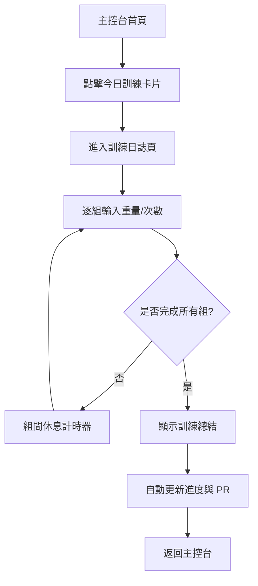
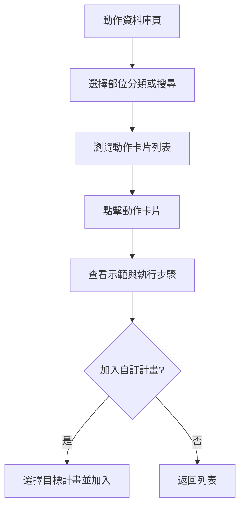

## 1. 產品概述

IRONPULSE 是一款專為力量訓練愛好者打造的手機應用程式，協助用戶記錄訓練、追蹤進度並提供專業指導。
- 解決傳統紙本訓練日誌不易統計、難以追蹤長期進步的問題，目標用戶為健身房常客、健力/健美愛好者
- 產品價值在於透過資料視覺化與智慧建議，讓訓練更科學、更有成就感

## 2. 核心功能

### 2.1 使用者角色

| 角色 | 註冊方式 | 核心權限 |
|------|---------------------|------------------|
| 一般用戶 | 本地註冊（免登入即可使用） | 瀏覽訓練計畫、記錄訓練、查看個人進度 |
| 進階用戶 | 自訂個人資料 | 解鎖進階統計分析、自訂訓練計畫範本 |

### 2.2 功能模組

1. **訓練主控台 (Dashboard)**：今日訓練概覽、累積數據、近期 PR（個人紀錄）展示
2. **訓練計畫 (Training Plans)**：內建力量訓練模板（5x5、推拉腿、上下分裂等）、可建立自訂計畫
3. **訓練日誌 (Workout Logger)**：即時記錄動作、組數、次數、重量，支援組間休息計時器
4. **進度追蹤 (Progress)**：重量曲線圖、訓練量統計、PR 紀錄列表
5. **動作資料庫 (Exercise Library)**：分類瀏覽力量動作，含示範圖示與要點說明
6. **設定 (Settings)**：深/淺雙主題切換、個人資料管理、資料重置

### 2.3 頁面詳情

| 頁面名稱 | 模組名稱 | 功能描述 |
|-----------|-------------|---------------------|
| 訓練主控台 | 今日訓練卡片 | 顯示今日排定訓練，一鍵開始；顯示本週累積訓練量 |
| 訓練主控台 | 累積數據區 | 總訓練次數、總舉起噸數、連續訓練天數徽章 |
| 訓練主控台 | 近期 PR 展示 | 卡片輪播展示三大項（臥推/深蹲/硬舉）最新 PR |
| 訓練計畫頁 | 計畫列表 | 內建計畫卡片含封面、難度標籤、訓練天數；可切換我的計畫 |
| 訓練計畫頁 | 計畫詳情 | 訓練日排程、每日動作清單、開始按鈕 |
| 訓練日誌頁 | 動作記錄區 | 每組記錄重量/次數/RPE，滑動編輯，自動計算總訓練量 |
| 訓練日誌頁 | 組間計時器 | 大圓環倒數計時，支援 +/- 15 秒調整，完成震動提示 |
| 訓練日誌頁 | 結束總結 | 完成訓練後顯示本次 PR、總訓練量、與上次對比 |
| 進度追蹤頁 | 重量曲線 | 折線圖展示指定動作重量變化，可切換 1RM/最大重量/平均 |
| 進度追蹤頁 | 訓練量統計 | 柱狀圖按週/月展示訓練量，部位分布圓環圖 |
| 進度追蹤頁 | PR 紀錄列表 | 按動作列出歷史 PR 與達成日期 |
| 動作資料庫頁 | 分類瀏覽 | 依部位（胸/背/腿/肩/手臂/核心）分類，搜尋框 |
| 動作資料庫頁 | 動作詳情 | 示範圖示、執行步驟、肌群標籤、常見錯誤提示 |

## 3. 核心流程

### 3.1 開始訓練流程

使用者從主控台看到今日排定訓練，點擊開始後進入訓練日誌，逐組記錄重量與次數，組間使用計時器休息，完成所有組數後系統自動生成訓練總結，並更新進度數據與 PR 紀錄。

### 3.2 瀏覽動作資料庫流程

使用者在資料庫頁依部位篩選或搜尋動作，點擊卡片查看詳細執行步驟，可將動作加入自訂訓練計畫。

## 4. 使用者介面設計

### 4.1 雙主題設計風格

APP 同時支援兩種主題，用戶可於設定中切換，主題偏好儲存於 LocalStorage。

#### 4.1.1 工業電力主題（深色 · 預設）

- **主背景**：深黑 `#0A0A0B`，強烈對比
- **次色 / 鐵灰**：`#1C1C1E`，用於區塊、按鈕基底
- **卡片背景**：`#2C2C2E`，冷灰卡片，層次分明
- **主要強調色**：電力綠 `#D4FF00`，主按鈕、重點數據
- **次要強調色**：電力綠線框，用於次按鈕
- **輔助色**：警示橘 `#FF6B35`，PR、教練提示
- **文字主色**：純白 `#FFFFFF`；文字次要：`#8E8E93`
- **按鈕風格**：主按鈕高飽和電力綠填色 + 銳利方角 (4px) + 輕微內陰影；次按鈕電力綠線框 + 透明底
- **字體**：標題 Bebas Neue（粗獷運動感），數據/重量 JetBrains Mono，正文 Noto Sans TC
- **卡片圓角**：銳利方角 (4px)，無陰影或極淡
- **分隔線**：粗線條 (2–3px)，電力綠或鐵灰
- **圖示**：線條粗獷幾何線性 (線寬 2.5–3px)，搭配重量符號與數字徽章
- **氛圍**：粗獷 · 工業 · 高對比 · 力量 · 賽博訓練

#### 4.1.2 高雅淺米白主題（淺色）

- **主背景**：暖調米白 `#F8F5F0`
- **次要背景**：淺卡其灰 `#F0ECE4`
- **卡片背景**：純白 `#FFFFFF`，帶輕微陰影
- **主文字**：深炭色 `#2C2B28`，非純黑更顯雅緻
- **次要文字**：暖灰 `#7A756D`
- **主要強調色**：香檳金 `#C9A96E`，按鈕、重點數據
- **次要強調色**：淡沙金 `#DBC9A8`，裝飾線、輕量提示
- **輔助色**：暖杏 `#E8A87C`，PR、里程碑
- **數據色**：墨綠松 `#4A7C7A`，重量、數值
- **按鈕風格**：主按鈕香檳金填色 + 圓角 (12px) + 細緻陰影；次按鈕香檳金線框 + 透明底
- **字體**：標題 Playfair Display（襯線高雅），數據/重量 JetBrains Mono，正文 Noto Sans TC
- **卡片圓角**：大圓角 (16px)，淺灰陰影
- **分隔線**：細緻 1px，香檳金或暖灰
- **圖示**：細線優雅幾何簡約 (線寬 1.5px)
- **氛圍**：通透 · 暖光 · 寧靜 · 高級感 · 自然材質

#### 4.1.3 主題切換機制

- 透過 CSS 變數實現主題切換，所有顏色、圓角、陰影皆以變數定義
- 切換時套用過渡動畫 (200ms ease)，避免突兀
- 主題偏好儲存於 LocalStorage，首次進入預設為工業電力主題

### 4.2 頁面設計概覽

| 頁面名稱 | 模組名稱 | UI 元素 |
|-----------|-------------|-------------|
| 訓練主控台 | 今日訓練卡片 | 主題底色卡片、強調色漸層邊框、大數字日期、CTA 按鈕 |
| 訓練主控台 | 累積數據區 | 三欄等寬、等寬數字字體、徽章式連續天數 |
| 訓練主控台 | PR 展示 | 橫向滑動卡片、輔助色標籤、肌群圖示 |
| 訓練計畫頁 | 計畫列表 | 大圖卡片、難度色塊、漸層覆蓋層 |
| 訓練日誌頁 | 動作記錄 | 滑動式組數列表、每組獨立卡片、+/- 重量按鈕 |
| 訓練日誌頁 | 計時器 | 全螢幕圓環動畫、大數字倒數、震動回饋 |
| 進度追蹤頁 | 圖表區 | 主題底色高對比折線圖/柱狀圖、強調色數據點、可切換區間 |
| 動作資料庫頁 | 分類標籤 | 橫向滑動部位標籤、網格卡片、圖示佔比 60% |
| 設定頁 | 主題切換 | 主題預覽卡、深/淺切換開關、即時套用 |

### 4.3 響應式設計

- 採用 **Mobile-first** 設計，目標裝置為手機（寬度 375px - 430px）
- 平板與桌面採用置中容器（最大寬度 480px），模擬手機介面並左右留黑邊
- 觸控優化：按鈕最小點擊區域 44x44px，組間計時器支援長按快速調整
- 橫屏僅在訓練日誌頁的計時器全螢幕模式支援
