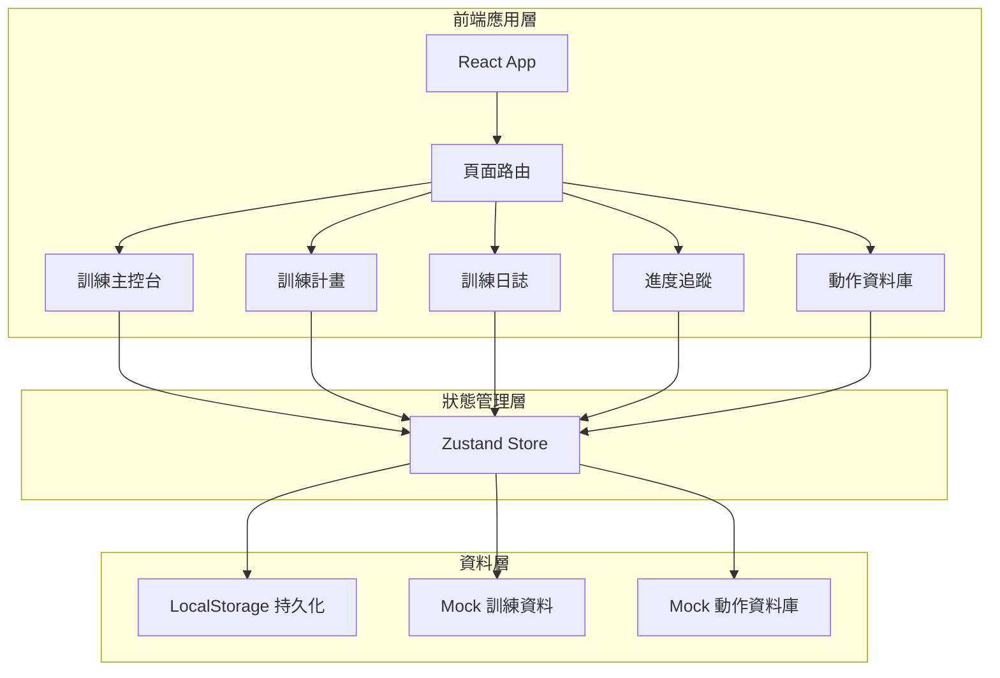
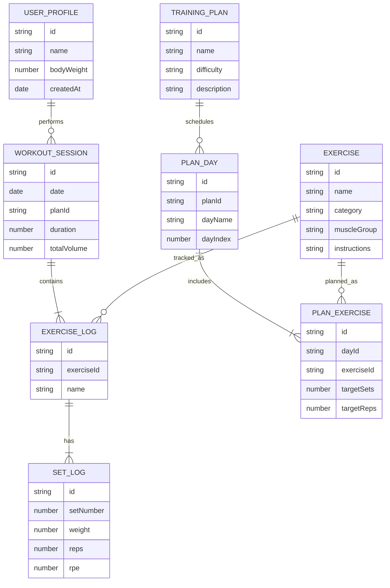

## 1. 架構設計



## 2. 技術說明

- **前端框架**：React@18 + Vite + TypeScript
- **樣式方案**：Tailwind CSS@3 + 自訂 CSS 變數（雙主題色系）
- **狀態管理**：Zustand（輕量、適合單頁應用）
- **圖表庫**：Recharts（響應式圖表，支援折線/柱狀/圓環圖）
- **動畫**：Framer Motion（頁面切換、卡片動畫、計時器過渡、主題切換過渡）
- **路由**：React Router@6
- **資料儲存**：瀏覽器 LocalStorage（無後端需求，離線可用）
- **初始化工具**：vite-init（React + TypeScript 模板）
- **主題系統**：以 CSS 變數實現深/淺雙主題切換，所有顏色、圓角、陰影透過變數動態切換

## 3. 路由定義

| 路由 | 用途 |
|-------|---------|
| `/` | 訓練主控台（預設頁） |
| `/plans` | 訓練計畫列表 |
| `/plans/:planId` | 計畫詳情 |
| `/workout` | 進行中訓練日誌 |
| `/workout/summary` | 訓練總結 |
| `/progress` | 進度追蹤 |
| `/exercises` | 動作資料庫 |
| `/exercises/:exerciseId` | 動作詳情 |
| `/settings` | 設定頁（主題切換、個人資料） |

## 4. 資料模型

### 4.1 資料模型定義



### 4.2 資料定義語言

由於本專案採用純前端 LocalStorage 儲存，無傳統 SQL 資料表，以下為 TypeScript 型別定義：

```typescript
// 用戶資料
interface UserProfile {
  id: string;
  name: string;
  bodyWeight?: number;
  createdAt: string;
}

// 訓練記錄
interface WorkoutSession {
  id: string;
  date: string;
  planId?: string;
  planName?: string;
  duration: number; // 秒
  totalVolume: number; // 總訓練量 (kg)
  exercises: ExerciseLog[];
}

interface ExerciseLog {
  id: string;
  exerciseId: string;
  name: string;
  sets: SetLog[];
}

interface SetLog {
  id: string;
  setNumber: number;
  weight: number;
  reps: number;
  rpe?: number;
  completed: boolean;
}

// 訓練計畫
interface TrainingPlan {
  id: string;
  name: string;
  difficulty: 'beginner' | 'intermediate' | 'advanced';
  description: string;
  days: PlanDay[];
}

interface PlanDay {
  id: string;
  dayName: string;
  dayIndex: number;
  exercises: PlanExercise[];
}

interface PlanExercise {
  id: string;
  exerciseId: string;
  name: string;
  targetSets: number;
  targetReps: string;
  targetWeight?: number;
}

// 動作資料庫
interface Exercise {
  id: string;
  name: string;
  category: 'chest' | 'back' | 'legs' | 'shoulders' | 'arms' | 'core';
  muscleGroup: string;
  equipment: string;
  instructions: string[];
  tips: string[];
}
```

## 5. 專案結構

```
ironpulse/
├── src/
│   ├── components/         # 可重用元件
│   │   ├── layout/         # 佈局元件 (BottomNav, Header)
│   │   ├── workout/        # 訓練相關元件 (SetRow, Timer)
│   │   └── ui/             # 通用 UI 元件
│   ├── pages/              # 頁面元件
│   │   ├── Dashboard.tsx
│   │   ├── Plans.tsx
│   │   ├── PlanDetail.tsx
│   │   ├── Workout.tsx
│   │   ├── WorkoutSummary.tsx
│   │   ├── Progress.tsx
│   │   ├── Exercises.tsx
│   │   ├── ExerciseDetail.tsx
│   │   └── Settings.tsx
│   ├── store/              # Zustand 狀態管理
│   │   ├── workoutStore.ts
│   │   ├── planStore.ts
│   │   ├── profileStore.ts
│   │   └── themeStore.ts
│   ├── data/               # Mock 資料
│   │   ├── exercises.ts
│   │   └── plans.ts
│   ├── types/              # TypeScript 型別
│   ├── utils/              # 工具函式
│   └── App.tsx
├── index.html
├── tailwind.config.js
└── vite.config.ts
```

## 6. 設計原則

- **離線優先**：所有資料存於 LocalStorage，無需網路即可使用
- **手機優先**：UI 以手機尺寸為主，桌面置中顯示
- **效能考量**：圖表使用虛擬化、動畫使用 transform 與 opacity
- **無後端依賴**：使用 Mock 資料作為預設訓練計畫與動作資料庫
